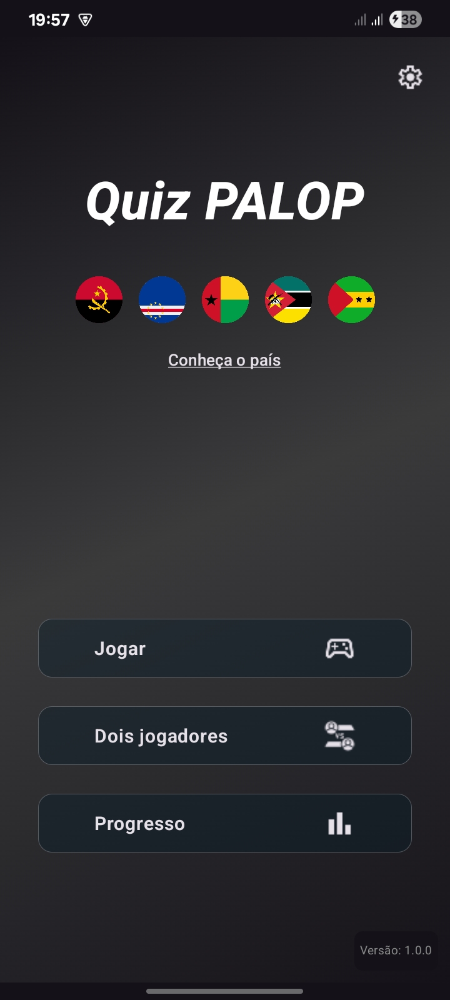

# Quiz PALOP


**Um jogo de quiz gratuito e open-source sobre os Países Africanos de Língua Oficial Portuguesa**

*A free, open-source quiz game about the Portuguese-speaking African countries*

[](https://kotlinlang.org)
[](https://developer.android.com/jetpack/compose)
[]()

<p align="center">


</p>
---

## 🇵🇹 Português

### Sobre o projecto

**Quiz PALOP** é um jogo de perguntas e respostas sobre os cinco Países Africanos de Língua Oficial Portuguesa — **Angola, Cabo Verde, Guiné-Bissau, Moçambique e São Tomé e Príncipe**. O objectivo é tornar divertido aprender sobre a história, cultura e curiosidades destes países, num formato leve e acessível a partir do telemóvel.

O projecto está actualmente em **testes fechados/abertos na Google Play Store**.

### ✨ Funcionalidades

- **Modo Quiz por país e categoria** — três níveis de dificuldade por país: *História Básica*, *Cultura Geral* e *Exame/Entrevista*
- **Modo Duelo** — dois jogadores competem em tempo real, respondendo às mesmas perguntas
- **Desafio Diário** — uma pergunta nova todos os dias, com notificação a lembrar o utilizador
- **Sistema de vidas e moedas** — perde-se uma vida a cada erro, com recuperação ao longo do tempo (ou via anúncio recompensado); moedas ganham-se ao acertar
- **Progresso do utilizador** — acompanhamento da percentagem de perguntas respondidas correctamente por categoria
- **Notificações locais** — lembrete diário do desafio e aviso de recuperação de vidas, agendados com `AlarmManager`
- **Página "Sobre os países"** — informação básica de cada país (capital, moeda, independência, área, países vizinhos, fuso horário)
- **Configurações** — som, vibração e permissões de notificação

### 🏗️ Arquitectura

O projecto segue os princípios de **Clean Architecture**, separado em três camadas:

```
org.quizpalop.app
├── domain/          # Regras de negócio — não depende de nenhuma outra camada
│   ├── model/        # Entidades: Question, Country, Pack, Category...
│   └── repository/   # Interfaces (contratos): QuizRepository, SettingsManager...
│
├── data/            # Implementação dos contratos do domain
│   └── repository/   # QuizRepositoryImpl (lê perguntas de ficheiros JSON em assets/)
│
├── presentation/    # UI e estado, um pacote por ecrã/feature
│   ├── maingamepage/     # Ecrã principal do quiz
│   ├── duel/              # Modo duelo
│   ├── dailychallenge/    # Desafio diário
│   ├── progress/          # Progresso do utilizador
│   ├── settings/          # Configurações
│   ├── configquestions/   # Configuração de nº de perguntas/dificuldade
│   ├── aboutcountries/    # Informação dos países
│   └── composables/       # Componentes reutilizáveis de UI
│
├── core/            # Utilitários transversais (haptics, notificações, ficheiros)
│   └── notifications/    # AlarmScheduler, NotificationHelper, BroadcastReceivers
│
└── ui/theme/        # Tema Compose (cores, tipografia)
```

Cada ecrã segue o padrão **MVVM**: um `ViewModel` expõe um `UiState` imutável via `StateFlow`, e eventos do utilizador são tratados através de uma classe `UiEvents` selada — mantendo a UI "burra" e fácil de testar.

### 🛠️ Stack técnico

| Categoria | Tecnologia |
|---|---|
| Linguagem | Kotlin |
| UI | Jetpack Compose |
| Navegação | [Voyager](https://voyager.adriel.cafe/) |
| Injecção de dependências | Koin |
| Persistência local | Jetpack DataStore (Preferences) |
| Serialização | kotlinx.serialization |
| Concorrência | Kotlin Coroutines + Flow |
| Notificações | AlarmManager + NotificationCompat |
| Animações | Lottie |
| Monetização | Google AdMob (anúncios recompensados) |

### 🚧 Roadmap / Contribuir

Este é um projecto pessoal, mas aberto a contribuições. As melhorias planeadas estão listadas nas [Issues](../../issues) do repositório — incluindo bugs conhecidos e funcionalidades futuras (mais países, mais idiomas, novos modos de jogo). Issues marcadas com `good first issue` são um bom ponto de partida para quem queira contribuir pela primeira vez.


### 👤 Autor

Desenvolvido por **Samuel Sumbane**.

---
---

## 🇬🇧 English

### About

**Quiz PALOP** is a trivia game about the five Portuguese-speaking African countries — **Angola, Cape Verde, Guinea-Bissau, Mozambique, and São Tomé and Príncipe**. The goal is to make learning about the history, culture, and trivia of these countries fun and accessible from a phone.

The project is currently in **closed/open testing on the Google Play Store**.

### ✨ Features

- **Quiz mode by country and category** — three difficulty tiers per country: *Basic History*, *General Culture*, and *Exam/Interview*
- **Duel mode** — two players compete in real time, answering the same set of questions
- **Daily Challenge** — a new question every day, with a reminder notification
- **Lives and coins system** — lose a life on a wrong answer, regain lives over time (or via a rewarded ad); earn coins for correct answers
- **User progress tracking** — percentage of correctly answered questions per category
- **Local notifications** — daily challenge reminder and life-recovery alert, scheduled via `AlarmManager`
- **"About the countries" page** — basic facts for each country (capital, currency, independence, area, bordering countries, timezone)
- **Settings** — sound, vibration, and notification permissions

### 🏗️ Architecture

The project follows **Clean Architecture**, split into three layers:

```
org.quizpalop.app
├── domain/          # Business rules — has no dependency on other layers
│   ├── model/        # Entities: Question, Country, Pack, Category...
│   └── repository/   # Contracts (interfaces): QuizRepository, SettingsManager...
│
├── data/            # Implementation of domain contracts
│   └── repository/   # QuizRepositoryImpl (loads questions from JSON files in assets/)
│
├── presentation/    # UI and state, one package per screen/feature
│   ├── maingamepage/     # Main quiz screen
│   ├── duel/              # Duel mode
│   ├── dailychallenge/    # Daily challenge
│   ├── progress/          # User progress
│   ├── settings/          # Settings
│   ├── configquestions/   # Question count / difficulty setup
│   ├── aboutcountries/    # Country info
│   └── composables/       # Reusable UI components
│
├── core/            # Cross-cutting utilities (haptics, notifications, files)
│   └── notifications/    # AlarmScheduler, NotificationHelper, BroadcastReceivers
│
└── ui/theme/        # Compose theme (colors, typography)
```

Each screen follows the **MVVM** pattern: a `ViewModel` exposes an immutable `UiState` via `StateFlow`, and user actions are handled through a sealed `UiEvents` class — keeping the UI "dumb" and easy to test.

### 🛠️ Tech stack

| Category | Technology |
|---|---|
| Language | Kotlin |
| UI | Jetpack Compose |
| Navigation | [Voyager](https://voyager.adriel.cafe/) |
| Dependency injection | Koin |
| Local persistence | Jetpack DataStore (Preferences) |
| Serialization | kotlinx.serialization |
| Concurrency | Kotlin Coroutines + Flow |
| Notifications | AlarmManager + NotificationCompat |
| Animations | Lottie |
| Monetization | Google AdMob (rewarded ads) |

### 🚧 Roadmap / Contributing

This is a personal project, open to contributions. Planned improvements are tracked in the repo's [Issues](../../issues) — including known bugs and upcoming features (more countries, more languages, new game modes). Issues labeled `good first issue` are a good starting point for first-time contributors.


### 👤 Author

Built by **Samuel Sumbane**.
